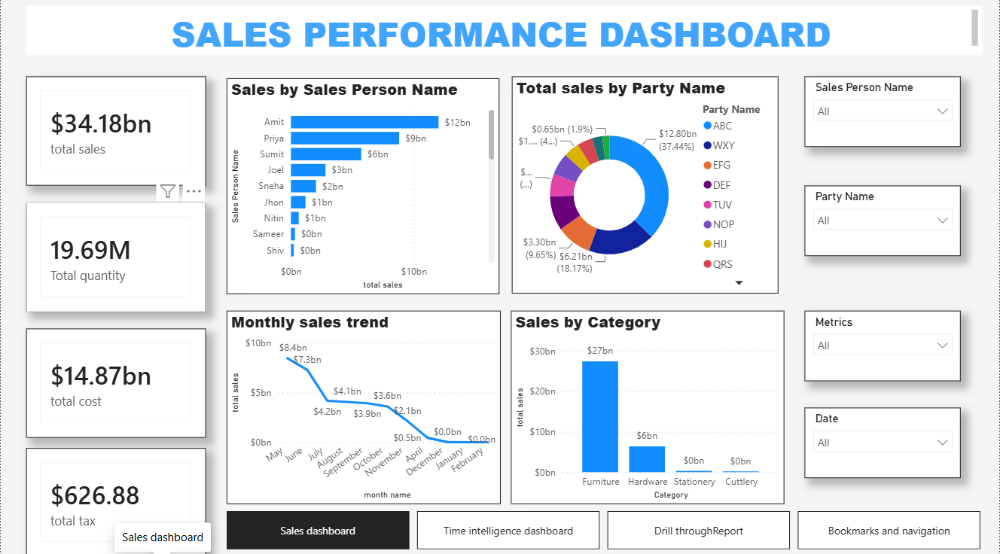
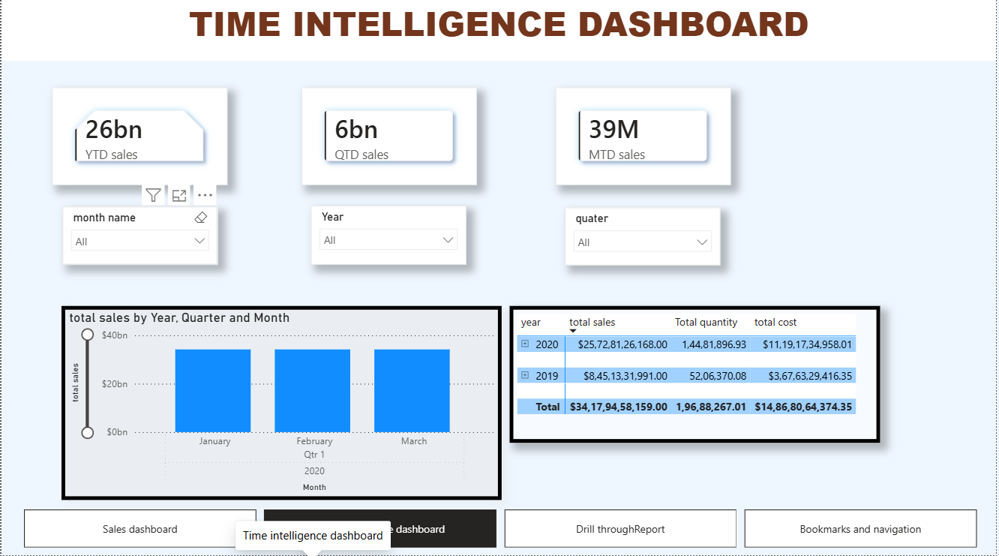
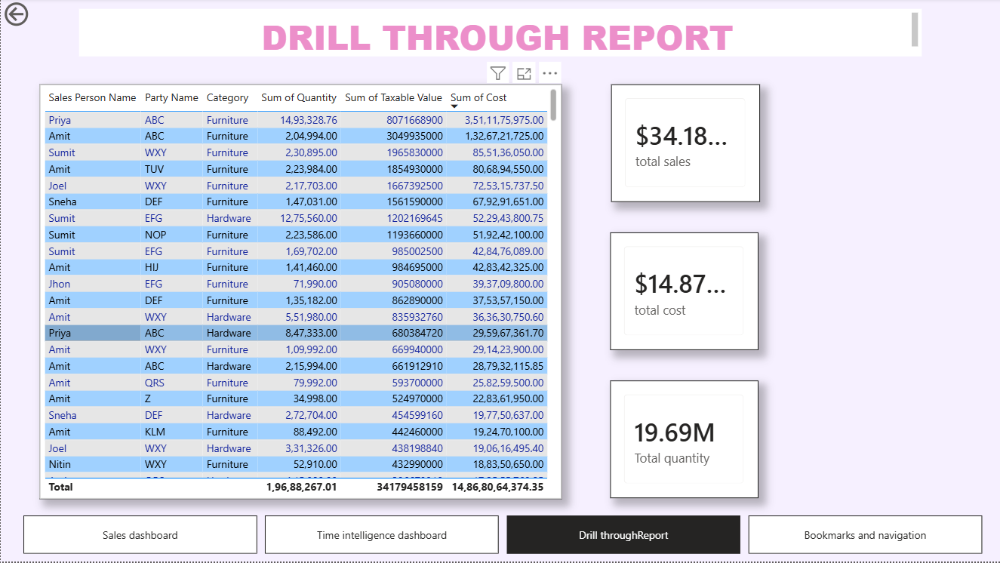
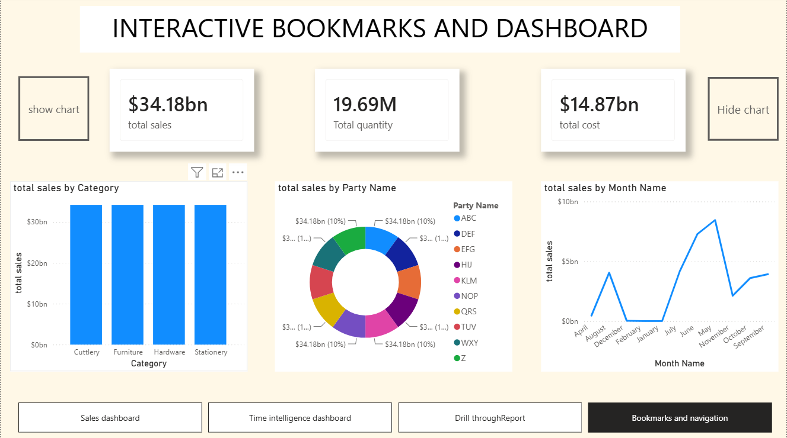

# Power-BI-Sales-Analytics-Dashboard

Interactive Power BI Sales Analytics Dashboard using DAX, Power Query, Time Intelligence, Drill Through, and Bookmarks.

## Project Overview

This project analyzes sales performance using interactive Power BI dashboards with time intelligence, drill-through analysis, and bookmark navigation.

## Features

- Sales Dashboard
- Time Intelligence Dashboard
- Drill Through Report
- Interactive Bookmarks and Navigation
- KPI Cards
- Interactive Filters and Slicers

## Tools Used

- Power BI
- Power Query
- DAX
- Data Modeling

## Dashboard Screenshots

